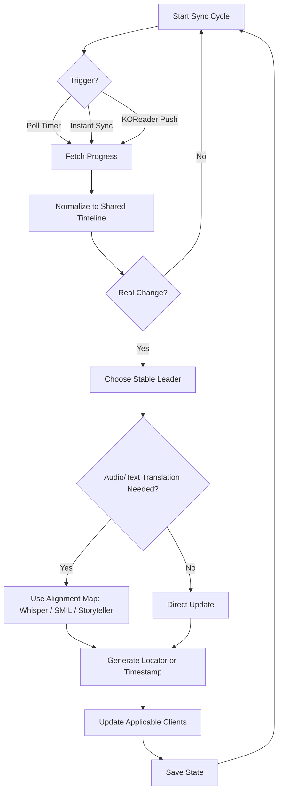

# BookBridge

<!-- markdownlint-disable MD033 -->

  
<strong>The ultimate bridge for cross-platform reading and listening synchronization.</strong>

  

    <a href="getting-started/" class="md-button md-button--primary">Getting Started</a>
    <a href="https://github.com/cporcellijr/bookbridge" class="md-button">View on GitHub</a>
  

<!-- markdownlint-enable MD033 -->

---

## What is it?

**BookBridge** is a self-hosted sync engine for audiobooks and ebooks. It keeps your reading and listening position aligned across multiple apps, whether the source is Audiobookshelf, KOReader, BookFusion, Grimmory, BookOrbit, Kavita, Calibre-Web Automated, or Storyteller. With the current Bridge Sync KOReader plugin, it can also move highlights and notes between supported readers.

### What do you actually need?

Just two things:

1. **Docker** on any host.
2. **At least two places you read or listen** that you want to keep in sync — for example Audiobookshelf on the audio side and KOReader on the ebook side.

Every service below is **optional** — switch on only the ones you actually use, and add more later. Ebook-only setups (KOReader plus Grimmory, say) work just as well as an audiobook pairing.

BookBridge does its own audio ↔ text alignment, using built-in Whisper transcription and the EPUB's own timing data where it exists. Nothing else needs to be in place for an audiobook and an ebook to stay in step.

### Supported Services

| Platform | Type | Capability |
| :--- | :--- | :--- |
| **Audiobookshelf** | Audiobooks + optional ebooks | Audiobook progress sync, optional ebook progress, library matching |
| **KOReader / KOSync** | Ebooks | Reading progress sync; highlights/notes through the current Bridge Sync plugin |
| **BookFusion** | Ebooks | Reading progress sync, highlight relay, and uploading local EPUBs into your BookFusion bookshelf |
| **Storyteller** | Optional read-along reader | Progress sync, plus higher-quality alignment for books you have already built there |
| **Grimmory** | Ebooks + audiobooks | Ebook progress, audiobook-source sync, reading sessions, optional annotation relay |
| **BookOrbit** | Ebooks + audiobooks | Ebook progress, audiobook-source sync, reading sessions, optional highlight relay |
| **Kavita** | Ebooks | EPUB search/download, bidirectional reading progress, collection-based auto-matching |
| **Calibre-Web Automated (CWA)** | Ebooks + Kobo-protocol sync | Ebook source/search/download; optional progress sync through CWA's Kobo sync protocol, used by stock Kobo readers and KOReader-via-CWA |
| **Readest** | Ebooks | Optional cloud highlight relay, optional book upload into a group |
| **Hardcover** | Reading tracker + lists | Write-only tracking, optional annotation relay, optional list-backed KOReader collections |
| **StoryGraph** | Reading tracker | Write-only tracking with edition picking |

!!! note "Highlights and notes"
    Annotation sync requires the Bridge Sync KOReader plugin from the current release or newer. Plain KOReader/KOSync clients continue syncing position, but they do not sync highlights or notes.

---

## Features

### Core Sync Engine

- **Multi-service sync** across the supported progress paths for Audiobookshelf, KOReader, BookFusion, Storyteller, Grimmory, BookOrbit, Kavita, CWA/Kobo sync, and reading trackers.
- **Flexible source support**: use Audiobookshelf, Grimmory, or BookOrbit as the audio source; use Audiobookshelf ebooks, BookFusion-linked books, Grimmory, BookOrbit, Kavita, CWA, or local files as the text side; or create ebook-only links when no audiobook is needed.
- **Split-port security** so the KOSync endpoint can be exposed separately from the dashboard.
- **Smart conflict handling** with anti-regression guardrails, a deadband for tiny cross-format bounce-backs, and deliberate rewinds that stick once you continue from the new position.
- **Highlight and note sync** for KOReader devices using the current Bridge Sync plugin, with optional Grimmory, BookOrbit, BookFusion, Readest, and Hardcover relay.
- **Book upload to Readest** (optional, per reader) that copies matched books, or just the
  ones you are currently reading, into your Readest cloud library and files them into a group.
- **Rich locators** using timestamps, href/fragment data, XPath, and EPUB CFI where available.
- **Built-in audio ↔ text alignment** using Whisper transcription and EPUB SMIL timing data — no extra services required. Content-match protection catches wrong pairings, Alignment Health scores and restores maps, and Storyteller transcript assets remain a premium source when available.
- **Resumable jobs** for background processing and transcript work.

### Management Web UI

- **Multiple readers** with their own sign-in, their own service logins, and their own progress — each person sees only the books they are reading.
- **Self-service integrations** so each reader can manage their own usernames, passwords, tokens, API keys, and sync toggles from Account -> My Integrations, while admins can still manage them centrally.
- **Dashboard** for live sync status, reading session details, direct service links, source badges, author/series/format filters, richer sorting, and a **Show position** excerpt of the text where you are currently synced.
- **Add / Update Book** for ABS, Grimmory, or BookOrbit audio; ABS, Grimmory, BookOrbit, Kavita, CWA, BookFusion, or local ebook sources; Storyteller links; ebook-only flows; and reader document fixes.
- **A match queue** inside Add / Update Book for reviewing and linking books in bulk.
- **Library Suggestions** for background scanning, review, and queue building.
- **Storyteller Editions** for building and uploading read-along books.
- **Watched collections** in Grimmory, BookOrbit, and Kavita that auto-match anything you drop into them.
- **Dynamic Settings** with live connection tests and automatic restart after saving.
- **Flexible setup** including an intentional Audiobookshelf-off mode for ebook-only or maintenance-focused use.
- **Optional Bridge Sync plugin support** for turning Grimmory shelves or Hardcover lists into KOReader collections, syncing reading stats, and syncing highlights/notes.

### Automation and Reliability

- **Background daemon** with configurable polling.
- **Instant sync** from ABS playback events and KOReader pushes when enabled.
- **Per-client polling** for Storyteller, Grimmory, BookOrbit, Kavita, and CWA/Kobo sync.
- **Library refresh and backfill tools** for connected ebook/audio sources and Storyteller alignment data.
- **Optional local-LLM assist (Ollama)** for smarter match suggestions and alignment rescue — off by default.

---

## How It Works

1. **Triggers**: the bridge reacts to ABS playback events, KOReader pushes, or scheduled polling.
2. **Normalization**: timestamps, percentages, CFI, and Storyteller locators are converted into a shared timeline.
3. **Change check**: tiny gaps are ignored so harmless drift does not cause sync churn.
4. **Leader election**: the bridge picks the most trustworthy current position.
5. **Translation**: if audio and text need to cross formats, the bridge resolves that position through its own alignment map — built from Whisper transcription or the EPUB's SMIL data, or from Storyteller transcripts if you use Storyteller.
6. **Propagation**: the resolved position is written back to every applicable client for that mapping.

!!! note "Storyteller, Grimmory, BookOrbit, and Kavita"
    All four are optional. Storyteller transcript assets improve locator quality when present; Grimmory or BookOrbit can act as either side of a mapping, while Kavita participates on the ebook side.
